# **Manual de Utilizador**

Diogo Dias - 202001673,
Rafael Maria - 202001443

Docentes:
Joaquim Filipe,
Filipe Mariano

### **Identificação do projeto**

Neste Documento, iremos abordar como o utilizador deverá preparar o sistema e utilizar o software, desenvolvido para a 1ª fase do projeto de Inteligência Artificial de 2022/2023 da Licenciatura de Engenharia Informática do Instituto Politécnico de Setúbal.

### **Introdução**
 O seguinte programa foi desenvolvido no âmbito da disciplina de Inteligência Artificial.

 Têm como objetivo desenvolver o jogo "Dots and Boxes", de forma a aplicarmos diversos algoritmos, tais como o DFS, BFS, A* e IDA* para obter a resolução ideal no problema proposto.

 ### **Instalação do Ambiente**
 Para conseguirmos utilizar o software, devemos instalar uma IDE para permitir utilizar código Lisp, bem como mostrar a funcionalidade do Programa.
Nós recomendamos a utilização da IDE LispWorks, pois é a IDE utilizada no ensino da Linguagem Lisp.

Nota: Esta instalação foi realizada num Windows 10 de 64-bit, caso seja para instalar em outras plataformas, seguir as instruções do website referido no 1º ponto da instalação.

1. Para a instalação do LispWorks devem começar pelo download do installer através do seguinte link. Escolhendo o ficheiro para realizar upload com base no seu Sistema Operativo.
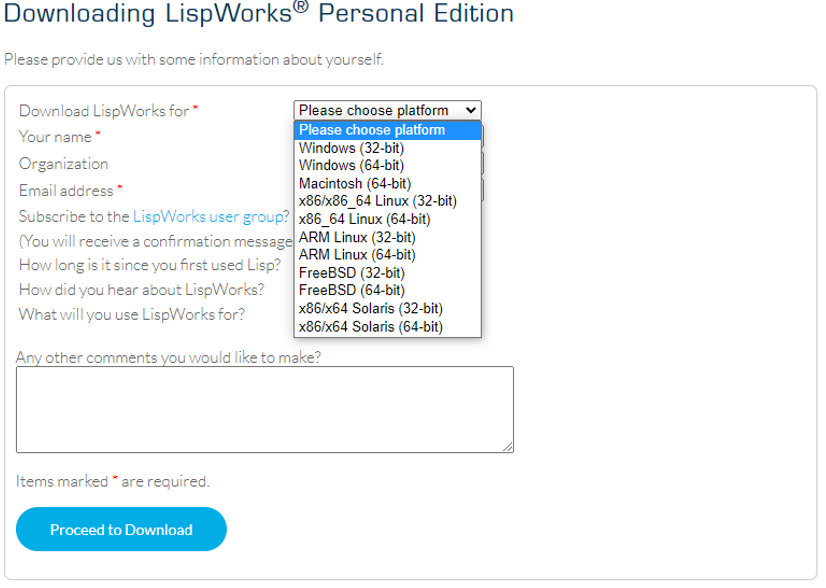
2. Após a finalização do Download, devem proceder á execução do mesmo e clicar em Next.
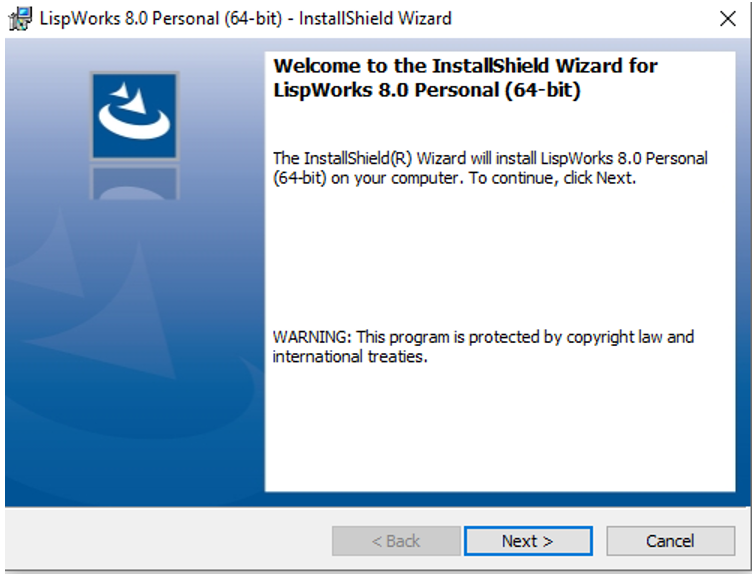
3. Concordar com os termos de Licença e utilização e clicar em Next.
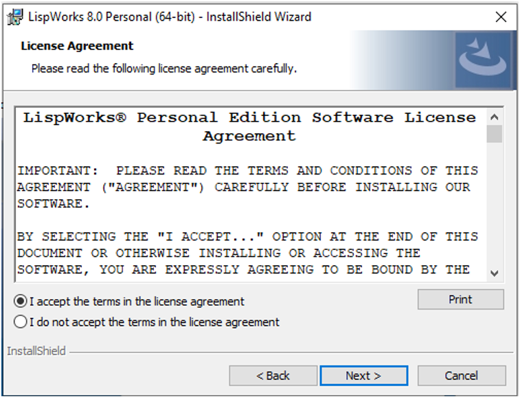
4. Clicar em Next (Opcional) Escolher o nome de utilizador e a organização que pertence.
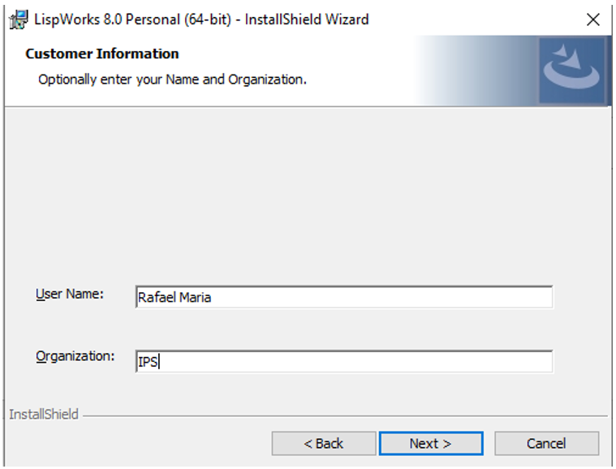
5. Clicar em Next (Opcional) Escolher o método de instalação customizável, porém não nos responsabilizamos em caso de não ser possível executar o software a partir deste método.
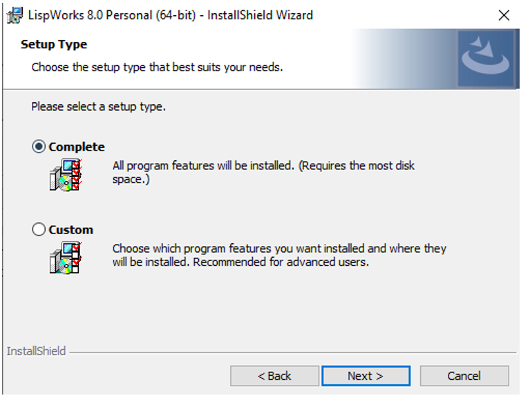
6. Clicar em Install. (Nota: pode ser que seja necessário dar permissões de Administrador).
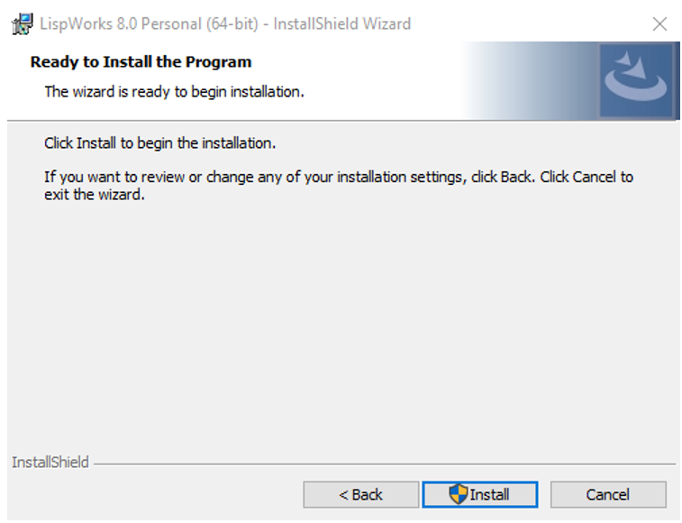
7. Clicar em Finish para terminar a instalação. (Nota: após a instalação é necessário reiniciar o dispositivo para utilizar LispWorks).
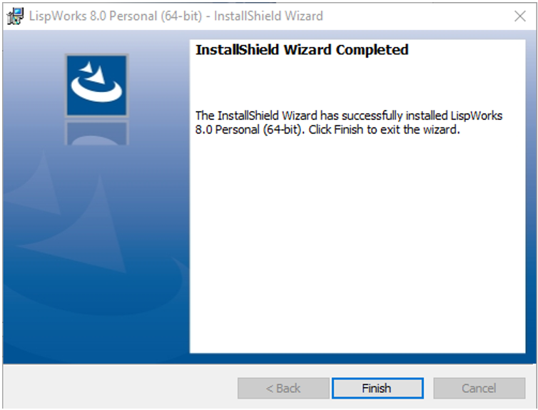

 ### **Utilização do Software**
 Nota: Apesar de ser permitida do LispWorks, em vários Sistemas operativos, entre Windows, Linux, Android e Ios. Só foi testado em Windows, pois era a única forma de teste dos Elementos do Grupo.

1. Abrir o LispWorks em modo de editor, carregando no icon que está dentro do quadrado.
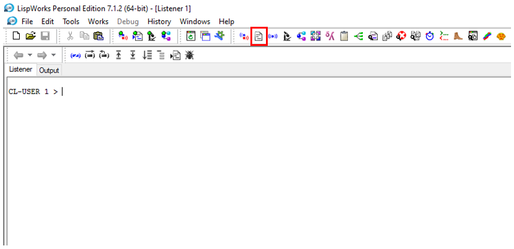
2. Carregamos em abrir um ficheiro, carregando no icon dentro do quadrado e selecionamos o ficheiro, “projeto.lisp”.
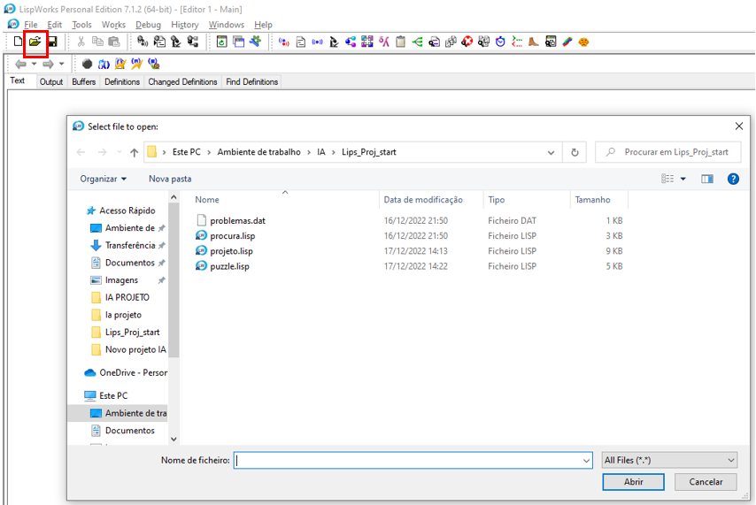
3. Compilar o buffer de modo a executar o programa que acabamos de abrir no editor, carregar no botão dentro do quadrado para executar o compiler.
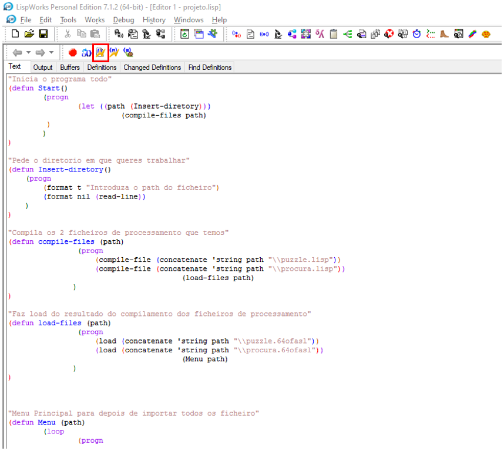
4. Entrar no Listener para iniciar o programa, chamando inicialmente a função “(start)”, para dar início ao programa, passando depois a diretoria de onde se encontram os ficheiros de processamento, “procura.lisp” e “puzzle.lisp”.
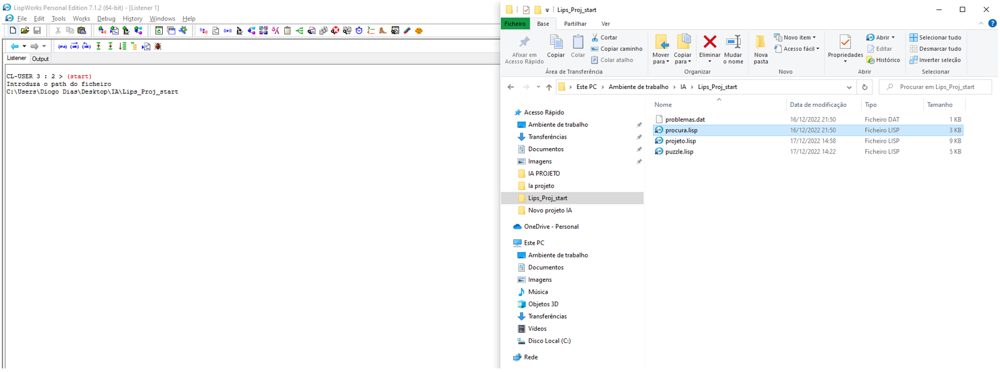
5. Após passar o path do diretorio dos ficheiros de processamento, o programa vai fazer o LOAD dos ficheiros e das funções dentro delas, pedindo em seguida ínicio do programa, basta escrever 1 ou 2. 1 inicia o programa, 2 finaliza o programa.
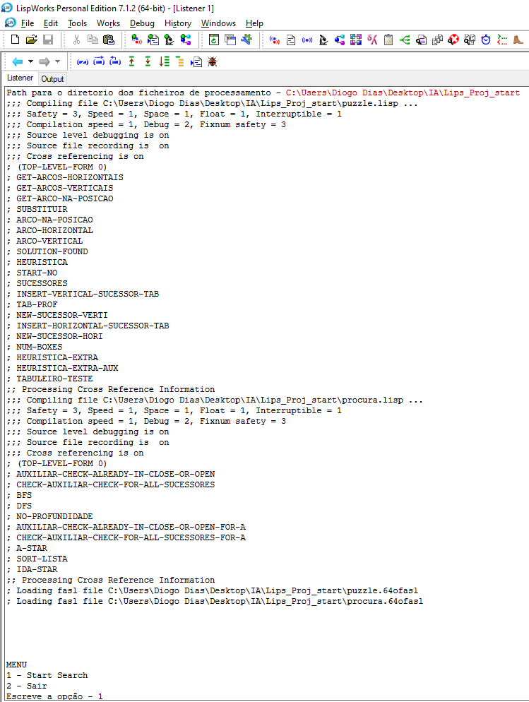
6. De seguida basta inserir o algoritmo que queremos utilizar, o número de caixas que queremos fechar, o problema ou tabuleiro inicial que queremos utilizar e consoante o algoritmo, qual a profundidade, para o DFS e qual a heurística para os algoritmos de espaço de estados.
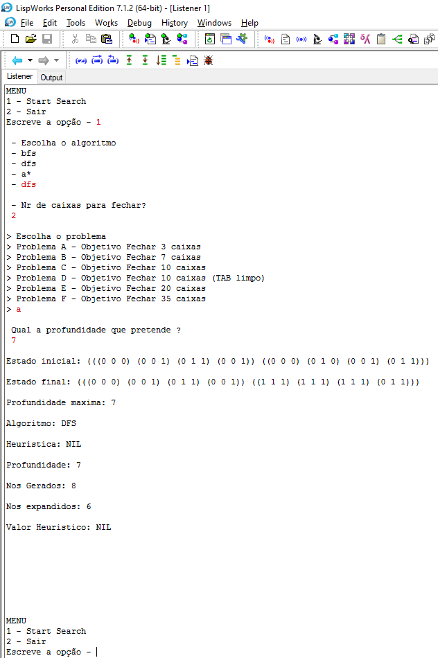

Por fim o programa chama a sua função start recursivamente podendo então experimentar os restantes algoritmos e tabuleiros.

 #### **Input/Output**

O programa recebe informação por parte de diversos ficheiros, tais como:
* Puzzle.lisp - Onde vai buscar as funções necessárias para processamento das operações.
* Procura.lisp - Onde vai buscar os diversos algoritmos implementados.
* Problemas.dat - Onde vai buscar os tabuleiros dos problemas que queremos resolver.

Por sua vez, o programa tem o output representado na figura 6, onde diz:
* Estado inicial do tabuleiro escolhido;
* Estado final do tabuleiro escolhido;
* Profundidade maxima atingida;
* A heurística utilizada;
* Todos os nós gerados;
* Todos os nós expandidos;
* O valor heurístico atingido;

 ## **Exemplo de aplicação**
Os comandos necessários para utilização da aplicação são básicos, contundo sempre que existe a necessidade de preenchimento de um campo para continuar com a utilização do programa, temos um exemplo do que escrever para que o programa corra corretamente.

| Questões (Pede)    | Commandos                | Insucesso                     | Sucesso               |
| :-------------:    |:-------------:           | :--------------------------:  |:-------------:        |
| Diretoria          | Diretoria dos ficheiros  |    Termina o programa         |   Continua o programa |
| Comecar            | 1 ou 2                   |    termina programa           |   Continua o programa |
| Algoritmo          | DFS/BFS/A*/IDA*          |    Repete Pergunta            |   N/A                 |
| Nr caixas a fechar | 0 a 100                  |    Repete Pergunta            |   N/A                 |
| Escolha do problema| A a F                    |    Repete Pergunta            |   N/A                 |
| Profundidade       | 0 a 100                  |    Termina o programa         |   Continua o programa |
| Heurística         | 1 ou 2                   |    Repete Pergunta            |   N/A                 |

