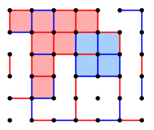

# **Manual Técnico**

Diogo Dias - 202001673
Rafael Maria - 202001443

Docentes:
Joaquim Filipe,
Filipe Mariano

## **Arquitetura do sistema**

### Módulos

Temos 3 módulos principais no projeto, tais como:

#### Projeto

+ Projeto.lisp -
O ficheiro de projeto é basicamente a zona onde fazemos a chamada de todas a funções, funciona como um main, temos os inputs dos utilizadores, são todos capturados e consoante as suas escolhas são posteriormente inseridas dentro das funções.

#### Puzzle

+ Puzzle.lisp -
O puzzle onde fazemos a montagem e tudo o que tem com o problema descrito, varia desde os sucessores ás heuristicas escolhidas ou dadas pelos professores.

#### Procura

+ Procura.lisp -
Por fim, temos o ficheiro de procura onde é estabelecido os nosso algoritmos como o dfs, bfs, A*' e o IDA* que é um dos exercícos bónus do projeto.

## Entidades e sua implementação

Nesta parte do documento está uma visão greal das funções que desenvolvemos em todo o projeto, de modo a que sejam agrupadas por funcionamento típico.
Para complemento desta informação temos os comentários feitos diretamente no código.

### **Ficheiro Projeto**

+ Nos ficheiros do projeto, globalmente decidimos agrupar certas funções consoante o seu funcionamento pois existem muitas funções de recolha de inputs do  utilizador, até mesmo de inserção das diretorias das pastas do projeto ou algoritmicas.
Sendo assim:

+ Funções de leitura de diretórios e compilação/load dos ficheiros:
  + Start()
  + Insert-diretory()
  + compile-files (path)
  + load-files (path)

+ Funções de leitura dos inputs do utilizador:
  + Menu (path)
  + read-tab (path)
  + read-num-boxes-close
  + read-algorithm ()
  + read-heuristic ()
  + read-depth ()

+ Funções de processamento e acesso a ficheiros externos:
  + Start-search (path)
  + results (no-inicial profundidade-maxima algoritmo heuristica solucao diretoria)
  + write-results-file (no-inicial profundidade-maxima algoritmo heuristica solucao diretoria)

+ Funções para guardar valores gerais:
  + lista-exists (elemento lista)

### **Ficheiro Puzzle**

+ Funções de Seletores:
  + get-arcos-horizontais (tab)
  + get-arcos-verticais (tab)
  + get-arco-na-posicao (x y tab)

+ Funções auxiliares:
  + substituir (pos lista &optional (var 1))
  + arco-na-posicao (x y tab &optional (value 1)

+ Funções relativas a Operadores:
  + arco-horizontal (fileira arco-pos tabuleiro)
  + arco-vertical (fileira arco-pos tabuleiro)
  + write-results-file (no-inicial profundidade-maxima algoritmo heuristica solucao diretoria)

+ Funções para guardar valores gerais:
  + lista-exists (elemento lista)
  + current-date-string ()

+ Funções Heurísticas:
  + heuristica(no value)
  + heuristica-extra (tab value)
  + heuristica-extra-aux(tab-side &optional (line 2))

+ Funções Sucessoras:
  + sucessores (no-init opera &optional (heu nil))
  + insert-vertical-sucessor-tab(tab &optional  (collum 1) (position 1) (heu nil))
  + new-sucessor-verti(tab collum position &optional (heu nil))
  + insert-vertical-sucessor-tab(tab &optional  (collum 1) (position 1) (heu nil))
  + new-sucessor-hori(tab line position &optional (heu nil))
  + insert-horizontal-sucessor-tab(tab &optional (line 1) (position 1) (heu nil))

+ Funções para encontrar o caminho:
  + no-pai (no)
  + caminho(no-final lista-fechados)
  + find-the-no-from-fechados(tab prof lista-fechados)

### **Ficheiro Procura**

+ Funções de algoritmia:
  + bfs (no-init solution sucessores opera &optional (aberto nil) (fechado nil))
  + dfs (no-init solution sucessores opera max &optional (aberto nil) (fechado nil))
  + a-star(no-init solution sucessores opera heu &optional (aberto nil) (fechado nil)
  + ida-star(no-init solution sucessores opera max-heur heu no-root &optional (aberto nil) (fechado nil))

+ Funções auxiliares apenas aos algoritmos BFS e DFS:
  + auxiliar-check-already-in-close-or-open(no &optional (abertos nil) (fechados nil))
  + check-auxiliar-check-for-all-sucessores(sucessores &optional (abertos nil) (fechados nil))
  + sort-lista (list)

+ Funções auxiliares apenas aos algoritmos  A*' e o IDA*:
  + auxiliar-check-already-in-close-or-open-for-a(no &optional (abertos nil) (fechados nil))
  + check-auxiliar-check-for-all-sucessores-for-a(sucessores &optional (abertos nil) (fechados nil))
  + new-max-heur (sorted-list max-heur)

+ Funções de estatíticas:
  + penetrancia (no nos-gerados)
  + ramification-factor(length-of-path total-nos)

## **Algoritmos e sua implementação**

### Breadth-First-Search (BFS)

A procura em largura (em Inglês Breadth-first) é um método de procura não-informada que expande todos os nós de uma árvore de uma solução. Este método realiza uma procura exaustiva numa árvore inteira, sem considerar o seu alvo de procura, até que ele o encontre. Este algoritmo não utiliza uma heurística.
Do ponto de vista do algoritmo, todos os nós filhos obtidos pela expansão de um nó são adicionados a uma fila (FIFO). Normalmente, nós que ainda não foram estudados pelos seus vizinhos são colocados num container (uma lista) designada por “lista de aberto". Uma vez examinados, são colocados num outro container, a “lista de fechados”.

### Depth-First-Search (DFS)

A procura em profundidade (Depth-first em Inglês) é um algoritmo de procura em profundidade realiza uma procura, não-informada, que progride através da expansão do primeiro nó filho da árvore de procura, e se aprofunda cada vez mais, até que o alvo da procura seja encontrado ou até que ele se depare com um nó que não possui filhos (nó folha). Então a procura retrocede (backtrack) e começa no próximo nó.

### A*

A procura A* é um tipo de procura informada (método heurística), ao contrário dos algoritmos já apresentados, que utiliza heurísticas de forma a direcionar a procura de uma solução. Recorrendo a uma heurística e estimando o custo de cada nó até a solução (composto por g (custo até ao nó em questão) e h (custo restante até à solução) é possível ordenar os nós a serem expandidos e assim explorar os que são mais prováveis de levar a uma solução. Desta forma reduz-se o número de nós a expandir tornando a pesquisa mais rápida.

### IDA*

IDA*(Iterative Deepening A*) é uma variante do algoritmo de busca A*, que é uma travessia de grafos e um algoritmo de busca de caminho usado para encontrar o caminho mais curto entre dois nós em um grafo. Como A*, IDA*' usa uma combinação da distância do nó inicial e uma estimativa da distância até o objetivo para determinar o próximo nó a ser visitado. No entanto, o IDA* executa uma pesquisa em profundidade e usa uma função heurística para pesquisar iterativamente mais profundamente no grafo, em vez de expandir todos os caminhos possíveis de uma só vez, como o A* faz.

Neste ponto do manual técnico iremos abordar o desempenho geral dos algoritmos segundo, os problemas que passamos.
Nota: É importante referir que o número de caixas passadas foi o mesmo que é pedido nos problemas utilizados, i.e. Problema A - Fechar 3 caixas, "Número de caixas passadas = 3".

### Problema A

| Algoritmo             | Profundida atengida   | Nós gerados                | Nós Expandidos           | Penetrancia   |Custo              | Valor heuristico          | Tempo                 |Ramificação     |
| :--:                  |:--:                   | :--:                          |:--:                   |:--:               |:--:               |:--:                       |:--:                   |:--:            |
| BFS                   |           11          |           122                 |        11             |0.09016393       | 11 | N/A | 0                          | 10.166667                                          |
| DFS                   |           12          |           116                 |        12             |0.0862069        |10|N/A|0|10.545455|
| A*                    |           2           |           46                    |     2              |0.04347826|2   |0      |0|15.333333|

### Problema B

| Algoritmo             | Profundida atengida   | Nós gerados                | Nós Expandidos           | Penetrancia   |Custo              | Valor heuristico          | Tempo                 |Ramificação     |
| :--:                  |:--:                   | :--:                          |:--:                   |:--:               |:--:               |:--:                       |:--:                   |:--:            |
| BFS                   |           5           |           66                |        5                 |0.07575758       | 5 | N/A | 0                          | 11.0                                         |
| DFS                   |           5          |           66                |        5             |0.07575758        |5|N/A|0|11.0|
| A*                    |           1           |           16                   |     1             |0.0625| 1  |0     |0|8|

### Problema C

| Algoritmo             | Profundida atengida   | Nós gerados                | Nós Expandidos           | Penetrancia   |Custo              | Valor heuristico          | Tempo                 |Ramificação     |
| :--:                  |:--:                   | :--:                          |:--:                   |:--:               |:--:               |:--:                       |:--:                   |:--:            |
| BFS                   |           12          |           151                |        12            | 0.0794702       | 12 | N/A | 0                          | 11.615385                                          |
| DFS                   |           12          |           151                 |        12             |0.0794702       |12|N/A|0|11.615385  |
| A*                    |           10            |           31                    |     14              |0.32258064|2   |10      |0|2.8181818|

### Problema D

| Algoritmo             | Profundida atengida   | Nós gerados                | Nós Expandidos           | Penetrancia   |Custo              | Valor heuristico          | Tempo                 |Ramificação     |
| :--:                  |:--:                   | :--:                          |:--:                   |:--:               |:--:               |:--:                       |:--:                   |:--:            |
| BFS                   |           45          |           1486                |        45             |0.030282638       | 45 | N/A | 31              | 32.304348                                          |
| DFS                   |           45          |           1486                 |        45            |0.030282638       |45|N/A|                  32.304348  |
| A*                    |           43            |           100                  |     105             |0.43|43  |0      |16|2.2727273|

### Problema E

| Algoritmo             | Profundida atengida   | Nós gerados                | Nós Expandidos           | Penetrancia   |Custo              | Valor heuristico          | Tempo                 |Ramificação     |
| :--:                  |:--:                   | :--:                          |:--:                   |:--:               |:--:               |:--:                       |:--:                   |:--:            |
| BFS                   |           28          |           771                 |        28             |0.036316473      | 28 | N/A | 0                          | 26.586207                                        |
| DFS                   |           28          |           771                 |        28             |0.036316473       |28|N/A|0|26.586207   |
| A*                    |           16            |           510                    |     16              |0.03137255|16   |0      |0|30|

### Problema F

| Algoritmo             | Profundida atengida   | Nós gerados                | Nós Expandidos           | Penetrancia   |Custo              | Valor heuristico          | Tempo                 |Ramificação     |
| :--:                  |:--:                   | :--:                          |:--:                   |:--:               |:--:               |:--:                       |:--:                   |:--:            |
| BFS                   |           95         |           5891                |        95             |0.016126294      | 95 | N/A | 422                          |     61.364582                      |
| DFS                   |           95          |           5891                 |        95            |0.016126294        |95|N/A|438 |61.364582|
| A*                    |           93           |           286                 |     151                 |0.32517484|93   |0      |94|3.0425532|

## **Opções tomadas**

Optamos por fazer as implementações dos Algoritmos em funções separadas, apesar de ser póssivel criar uma função génerica, isto vai de encontro ao refactoring que é possível aplicar.

## **Limitações**

### **Requisitos não implementados**

A implementação dos Algoritmos SMA* e RBFS.

### Refactoring póssivel de fazer

Dentro da Realização do Projeto foi possível perceber a existência de Refactoring que podiam ser implementados, dentro dos quais temos:

+ Utilização da função Let e Let* para não existir repetição de chamada ás mesmas funções;
+ Utilização de operações para o problema em vez de repetir a operação car e cdr;
+ Nos algoritmos existir uma implementação génerica (especialmente para o DFS e BFS);
+ Os nomes de Algumas váriaveis;

### Melhoramentos potências

+ Há espaço para melhorias, de forma a fazer com que a eficiência e legibilidade do código sejam facilitadas, o cumprimento do Refactoring mencionado no ponto anterior é um dos pontos a melhorar tambêm.
+ A limitação da própria IDE do LispWorks Personal, pois contêm um Limite na memória Heap.
+ Para finalizar, a ultíma melhoria que poderiamos efetuar no projeto, seria o funcionamento do IDA*, contudo, ele está implementado.
