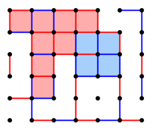

# **Manual de Utilizador**

Diogo Dias - 202001673,
Rafael Maria - 202001443

Docentes:
Joaquim Filipe,
Filipe Mariano

## **Acrónimos**

+ BFS -  Breath first Search
+ DFS -  Depth first Search

## **Identificação do projeto**

Neste Documento, iremos abordar como o utilizador deverá preparar o sistema e utilizar o software, desenvolvido para a 2ª fase do projeto de Inteligência Artificial de 2022/2023 da Licenciatura de Engenharia Informática do Instituto Politécnico de Setúbal.

## **Introdução**

 O seguinte programa foi desenvolvido no âmbito da disciplina de Inteligência Artificial.

 Têm como objetivo desenvolver o jogo "Dots and Boxes", em dois modos de jogo estes sendo, Humano vs CPU em que podemos jogar e tentar vencer o computador que não nos facilitará a vida, ou CPU vs CPU em que iremos ver uma batalha entre CPU's de modo a ver quem sai vitorioso.

## **Instalação do Ambiente**

 Para conseguirmos utilizar o software, devemos instalar uma IDE para permitir utilizar código Lisp, bem como mostrar a funcionalidade do Programa.
Nós recomendamos a utilização da IDE LispWorks, pois é a IDE utilizada no ensino da Linguagem Lisp.

Nota: Esta instalação foi realizada num Windows 10 de 64-bit, caso seja para instalar em outras plataformas, seguir as instruções do website referido no 1º ponto da instalação.

1. Para a instalação do LispWorks devem começar pelo download do installer através do seguinte link. Escolhendo o ficheiro para realizar upload com base no seu Sistema Operativo.

2. Após a finalização do Download, devem proceder á execução do mesmo e clicar em Next.

3. Concordar com os termos de Licença e utilização e clicar em Next.

4. Clicar em Next (Opcional) Escolher o nome de utilizador e a organização que pertence.

5. Clicar em Next (Opcional) Escolher o método de instalação customizável, porém não nos responsabilizamos em caso de não ser possível executar o software a partir deste método.

6. Clicar em Install. (Nota: pode ser que seja necessário dar permissões de Administrador).

7. Clicar em Finish para terminar a instalação. (Nota: após a instalação é necessário reiniciar o dispositivo para utilizar LispWorks).

## **Utilização do Software**

 Nota: Apesar de ser permitida do LispWorks, em vários Sistemas operativos, entre Windows, Linux, Android e Ios. Só foi testado em Windows, pois era a única forma de teste dos Elementos do Grupo.

1. Abrir o LispWorks em modo de editor, carregando no icon que está dentro do quadrado.

2. Carregamos em abrir um ficheiro, carregando no icon dentro do quadrado e selecionamos o ficheiro, “jogo.lisp”.

3. Compilar o buffer de modo a executar o programa que acabamos de abrir no editor, carregar no botão dentro do quadrado para executar o compiler.

4. Entrar no Listener para iniciar o programa, chamando inicialmente a função “(start)”, para dar início ao programa, passando depois a diretoria de onde se encontram os ficheiros de processamento, “Algoritmo.lisp” e “puzzle.lisp”.

5. Após passar o path do diretorio dos ficheiros de processamento, o programa vai fazer o LOAD dos ficheiros e das funções dentro delas, pedindo em seguida ínicio do programa, basta escrever 1 a 3. 1 Inicia o jogo modo: Humano vs CPU, 2 Inicia o programa CPU vs CPU e 3 encerra o programa.
Após esta opção ser escolhida, aparece um Pop up no qual pergunta se queremos jogar como player 1 ou 2 em que, no caso de escolho do primeiro jogador, jogamos primeiro e no caso da escolha ser segundo jogador será o segundo a jogar.

6. De seguida basta inserir a profundidade máxima que queremos atingir, e o tempo de procura máximo que podemos atingir.
Para complementar aparece ainda uma representação gráfica do estado do tabuleiro.

7. Neste ponto o programa faz uma serie de perguntas encadeadas, como, se o arco que quer meter é horizontal ou vertical, qual a posição em que quer meter o arco e o seu index.
Após esta seleção o programa demonstra como ficou o tabuleiro e se foi pontuado/fechada alguma caixa.

Por fim o programa chama a sua função start recursivamente podendo então continuar a jogar até estar totalmente preenchido o tabuleiro.

### **Input/Output**

O programa recebe informação por parte de diversos ficheiros, tais como:

+ Puzzle.lisp - Onde vai buscar as funções necessárias para processamento das operações.
+ Algoritmo.lisp - Onde vai buscar os diversos algoritmos implementados.
+ Jogo.lisp - Onde está presente a interface com o utilizador.

Por sua vez, o programa tem o output representado na figura 6, onde diz:

+ Estado do tabuleiro;
+ Pontuação de cada jogador;
+ Tempo de jogada;

## **Exemplo de aplicação**

Os comandos necessários para utilização da aplicação são básicos, contundo sempre que existe a necessidade de preenchimento de um campo para continuar com a utilização do programa, temos um exemplo do que escrever para que o programa corra corretamente.

| Questões (Pede)		| Commandos						| Insucesso                     | Sucesso					 |
| :-------------:		|:-------------:				| :--------------------------:  |:-------------:			 |
| Diretoria				| Diretoria dos ficheiros		|    Termina o programa         |   Continua o programa      |
| Menu					| 1 a 3							|    Repete Pergunta            |   Continua o programa/sair |
| Player 1/2			| Pop up - Yes/No				|    N/A						|   Continua o programa      |
| Profundidade			| 1 a ∞							|    Repete Pergunta			|   Continua o programa      |
| Tempo					| 1 a ∞							|    Repete Pergunta			|   Continua o programa      |
| Escolha do Lado		| 1 ou 2 - Vertical/Horizontal	|    Repete Pergunta			|   Continua o programa      |
| Escolha da Posição	| 1 a ∞ (Com base no tabuleiro)	|    Repete Pergunta			|   Continua o programa      |
| Escolha do Index		| 1 a ∞ (Com base no tabuleiro)	|    Repete Pergunta			|   Continua o programa      |

## **Limitações do programa**

+ Devido ao UI do LispWorks não ser o ideal para o representação gráfica de um jogo, a introdução dos comandos para interação com o jogo é bastante rudimentar;
